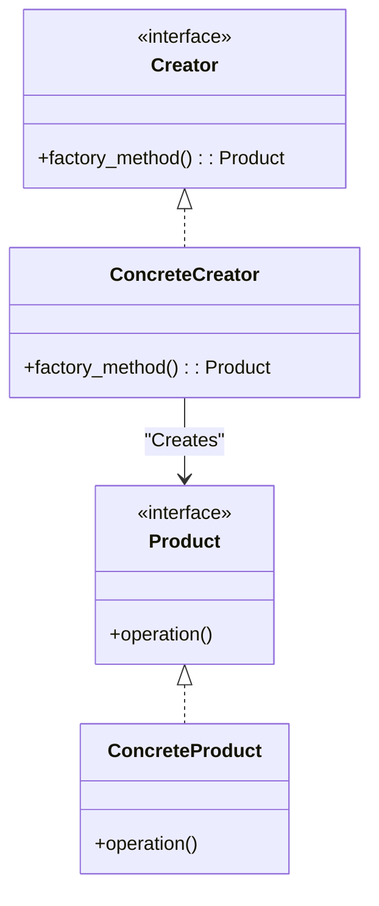

# תבנית Factory - מדריך

## מבוא
תבנית Factory היא תבנית עיצוב שמטרתה להפריד את הלוגיקה של יצירת האובייקטים מהשימוש בהם. במקום ליצור מופעים של אובייקטים ישירות בקוד הלקוח, תבנית זו מאפשרת לקבוע במחלקה ייעודית (Factory) איזו מחלקה קונקרטית תיווצר. הדבר מסייע בשיפור התחזוקה, בקריאות הקוד ובהרחבת המערכת בעתיד.

## מתי משתמשים בתבנית זו
- **הסתרת לוגיקת יצירת האובייקטים:** מאפשרת לשנות את אופן היצירה מבלי להשפיע על הקוד המשתמש.
- **עבודה עם תתי-מחלקות מרובות:** כאשר יש מגוון סוגים של אובייקטים, ניתן לאציל את הבחירה במחלקת Factory אחת.
- **הרחבת המערכת בקלות:** ניתן להוסיף סוגים חדשים של אובייקטים מבלי לשנות את הלוגיקה של הקוד הלקוח.

## מבנה המחלקות
### רכיבים עיקריים:
- **(מוצר) Product:** ממשק או מחלקה אבסטרקטית המגדירה את הפונקציונליות של האובייקט.
- **(מוצר קונקרטי) ConcreteProduct:** מחלקה שמממשת את המוצר ומספקת התנהגות ספציפית.
- **(יוצר) Creator:** מחלקה או ממשק שמכריז על מתודת הפקטורי (`factory_method`) ליצירת האובייקטים.
- **(יוצר קונקרטי) ConcreteCreator:** מממשת את מתודת הפקטורי ומחליטה איזה מוצר קונקרטי לייצר.

### דיאגרמת UML בסיסית


## דוגמת קוד בפייתון

```python
from abc import ABC, abstractmethod

# Product interface
class Product(ABC):
    @abstractmethod
    def operation(self):
        pass

# ConcreteProduct implements Product
class ConcreteProduct(Product):
    def operation(self):
        print("Operation of ConcreteProduct")

# Creator abstract class with the factory method
class Creator(ABC):
    @abstractmethod
    def factory_method(self) -> Product:
        pass

    # A method that uses the product
    def do_something(self):
        product = self.factory_method()
        product.operation()

# ConcreteCreator implements the factory method to return a ConcreteProduct
class ConcreteCreator(Creator):
    def factory_method(self) -> Product:
        return ConcreteProduct()

# Client code
if __name__ == "__main__":
    creator = ConcreteCreator()
    creator.do_something()

```

## דוגמת מעשית

```python
from abc import ABC, abstractmethod

# Product interface: Document
class Document(ABC):
    @abstractmethod
    def read(self):
        pass

# Concrete Product: PDF Document
class PDFDocument(Document):
    def read(self):
        print("Reading PDF document")

# Concrete Product: Word Document
class WordDocument(Document):
    def read(self):
        print("Reading Word document")

# Creator abstract class with a factory method
class DocumentFactory(ABC):
    @abstractmethod
    def create_document(self, doc_type: str) -> Document:
        pass

# Concrete Creator that implements the factory method
class ConcreteDocumentFactory(DocumentFactory):
    def create_document(self, doc_type: str) -> Document:
        if doc_type.lower() == 'pdf':
            return PDFDocument()
        elif doc_type.lower() == 'word':
            return WordDocument()
        else:
            raise ValueError("Unknown document type")

# Client code demonstrating the usage of the factory
if __name__ == "__main__":
    factory = ConcreteDocumentFactory()
    
    # Create and use a PDF document
    pdf_doc = factory.create_document("pdf")
    pdf_doc.read()
    
    # Create and use a Word document
    word_doc = factory.create_document("word")
    word_doc.read()

```

## סיכום
תבנית Factory מאפשרת להפריד בין הלוגיקה של יצירת האובייקטים לבין השימוש בהם, מה שמביא לגמישות רבה יותר במערכת ולתחזוקה פשוטה יותר. כאשר יש צורך להוסיף או לשנות סוגי אובייקטים, השינוי מתבצע רק במחלקת הפקטורי, מה שמקל על ניהול ושדרוג המערכת.


באמצעות מדריך זה ניתן ללמוד ולהטמיע את תבנית Factory בפרויקטים שלכם, ולהשתמש בה לכתיבת קוד גמיש, קריא וקל לתחזוקה.